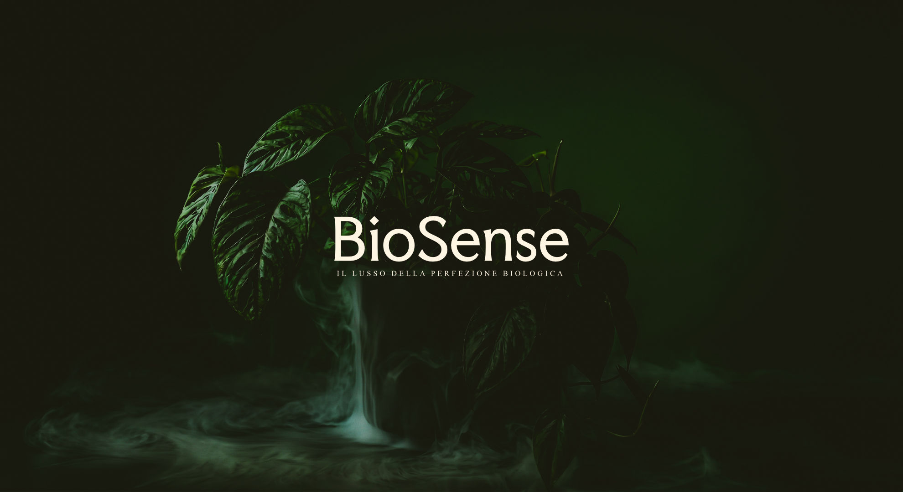

<!-- 
  COME USARE QUESTO TEMPLATE:
  1. Copia il contenuto di questo file o duplica il file stesso.
  2. Rinomina la copia rimuovendo il carattere '_' all'inizio (es: "mio-progetto.md").
  3. Modifica i metadati sopra. Attenzione: il campo "status" deve essere esattamente "in corso" o "completato".
  4. Descrivi il progetto qui sotto in formato Markdown.
-->

***Un bonsai morto. È da lì che tutto è cominciato.***
Non per negligenza, ma per ignoranza,la stessa che accomuna chiunque abbia mai provato a coltivare qualcosa in casa senza sapere davvero di cosa avesse bisogno. 

L'acqua giusta, i nutrienti giusti, il momento giusto: variabili invisibili che nessuno strumento accessibile sa leggere per te. I sistemi professionali esistono, ma costano centinaia di euro, richiedono calibrazione continua e trasformano la cura di una pianta in un lavoro da laboratorio.
BioSense nasce per risolvere questo: portare la precisione agronomica dove non è mai arrivata, senza sensori chimici, senza complessità, senza abbonamenti. Un sistema che osserva, impara e ti avvisa prima che la pianta ti dica che è troppo tardi.

### Dettagli del Progetto

Puoi strutturare la descrizione usando elenchi puntati:
- **Tecnologie**: ESP32, DS18B20, OLED, ugello ultrasonico, C++, PlatformIO, TFLite Micro, Python, TensorFlow, scikit-learn, Flask, HTML/JS o Flutter.
- **Obiettivo**: Invece di misurare direttamente la chimica della soluzione nutritiva, il sistema impara a interpretarla attraverso il comportamento della pianta nel tempo, i cicli di coltivazione accumulati e la storia precisa di ogni integrazione nutritiva. Un'intelligenza che gira interamente sul dispositivo, senza cloud, senza connessioni esterne, senza dipendenze.
- **Risultato**: Quando i nutrienti si avvicinano alla soglia critica, BioSense ti avvisa in anticipo. La pianta non deve dirti che sta male: il sistema lo sa già.
